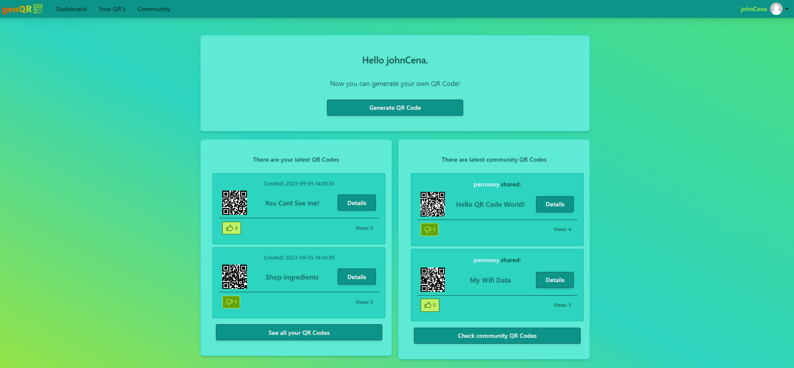

# genQR



## Description

This Laravel application is designed for generating QR codes with various content types, such as plain text, URL, email address, phone number, GPS location, and Wi-Fi network login credentials. Users can either log in traditionally or use Google authentication through Laravel/Socialite.

## Features

- **User Authentication**: Traditional login and Google authentication (Laravel/Socialite).
- **QR Code Generation**: Generate QR codes with customizable content:
    - Name & Description of code, which allows you to indetify it on the site,
    - [Error correction](https://en.wikipedia.org/wiki/QR_code#Error_correction) options, allows damaged QR Codes be still scanable,
    - Image size.
- **QR Code Privacy**: Users can set QR codes to public, making them visible in the community section.
- **Community Section**: View and interact with public QR codes generated by other users including a search for interesting ones.
- **Download QR Codes**: Users can download their own QR codes and public QR codes in PNG format.
- **QR Code Removal**: Users can delete their own QR codes.
- **Like Feature**: Users can "like" QR codes, with a limit of one like per code.
- **Profile Page**: User can present hismelf editing Profile section and sharing f.e. link to socials.

The content of QR Code is not stored in a database, so the Image is a "Data Storage".

## Installation

1. Clone the repository:

   ```bash
   git clone https://github.com/peroxovy/genqr.git
   ```

2. Install dependencies:

    ```bash
    composer install
    npm install
    ```
3. Configure `config/services.php` with Google OAuth credentials:

    ```php
    'google' => [
        'client_id' => 'your_client_id',
        'client_secret' => 'your_client_secret',
        'redirect' => 'https://{app_url}/login/google/callback',
    ],
    ```
4. Edit your `.env` file with correct database name.

5. Run migrations and seed database:

    ```bash
    php artisan migrate --seed
    ```

6. Generate an application key:

    ```bash
    php artisan key:generate
    ```
7. Create storage link:
    
    ```bash
    php artisan storage:link
    ```

8. Compile vite assets:

    - For production:
        - `npm run build`
    - For development:
        - `npm run dev`

9. Start development server:

    ```bash
    php artisan serve
    ```
## Important

If you are willing to change your username inside an application, please run following command in CLI:

```bash
php artisan queue:work
```

It's responsible for handling for any scheduled jobs. In our case it is handling directory-rename algorithm done in the background.

Also you can use [Supervisor](https://laravel.com/docs/10.x/queues#supervisor-configuration), that will run in the background like `cron job`.

## Technologies used

- [PHP](https://www.php.net/) in version 8.1.1
- [Laravel](https://laravel.com/) in version 10.17.1
- [Livewire](https://livewire.laravel.com/)(fresh after beta) in version 3.0.1
- [Alpine.js](https://alpinejs.dev/)
- [TailwindCSS](https://tailwindcss.com/)

## Libraries & extensions used

- [laravel/socialite](https://laravel.com/docs/10.x/socialite) for Google authentication
- [simplesoftwareio/simple-qrcode](https://github.com/SimpleSoftwareIO/simple-qrcode) for QR Code generating
- [wire-elements/modal](https://github.com/wire-elements/modal) for Livewire modals
- [ImageMagick](https://www.php.net/manual/en/book.imagick.php) for handling images with PHP
